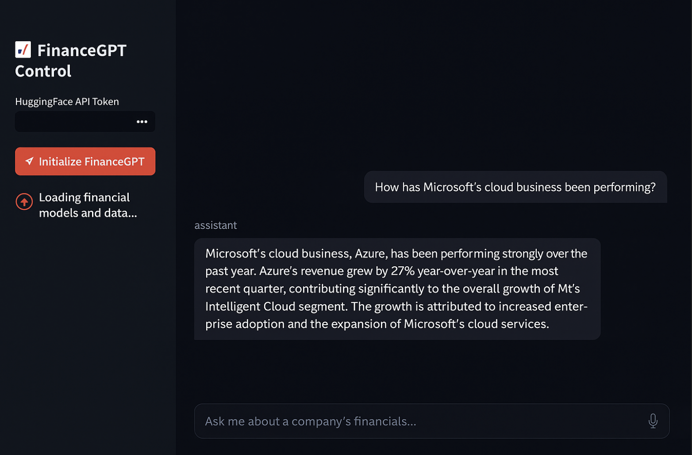

# 📈 FinanceGPT

**FinanceGPT** is an AI-powered investment research platform that leverages LangChain, Hugging Face models, and Streamlit to deliver intelligent financial insights from SEC filings, earnings reports, and market data.

---

## 🚀 Features

- 📋 **SEC Filing Analysis**: Parse and analyze 10-K, 10-Q, 8-K, and other reports.
- 📊 **Real-Time Market Data**: Integrates with Yahoo Finance to pull up-to-date metrics.
- 💡 **AI-Powered Insights**: Uses LLMs to generate concise, intelligent answers to financial queries.
- 🧠 **Vector Search with FAISS**: Indexes and retrieves relevant document chunks for context-aware responses.
- ⚠️ **Risk Scoring Engine**: Calculates risk levels based on financial data, sector exposure, and market conditions.
- 📉 **Sentiment Analysis**: Applies NLP techniques to classify financial sentiment as Bullish, Bearish, or Neutral.
- 📂 **Research History Dashboard**: Visualizes past queries, performance trends, and sentiment breakdowns.

---

## 🖥️ UI Overview

The app includes:

- A Streamlit-powered dashboard  
- Sidebar with Hugging Face API key input and initialization control  
- Dynamic analysis cards with confidence, sentiment, risk, and company metrics  
- Visualization panels (Plotly) for market and risk analytics  
- Source document exploration with document metadata



---

## 🧰 Tech Stack

- **Frontend**: Streamlit  
- **Backend**: Python, LangChain, FAISS, Hugging Face Hub  
- **LLM Embeddings**: `sentence-transformers/all-MiniLM-L6-v2`  
- **LLM QA Model**: `microsoft/DialoGPT-medium` or `google/flan-t5-small`  
- **Finance Data**: Simulated SEC filings and market metrics  
- **Visualization**: Plotly Express & Graph Objects  

---

## 🛠️ Installation

```bash
# Clone the repository
git clone https://github.com/your-username/financegpt.git
cd financegpt

# Create a virtual environment
python3 -m venv venv
source venv/bin/activate

# Install dependencies
pip install -r requirements.txt
```

## ▶️ Running the App
```bash
streamlit run financegpt_app.py
```
Open your browser to http://localhost:8501 and input your Hugging Face API token to initialize the system.

## 🔑 API Key Required
To use Hugging Face models, you'll need a free API key from huggingface.co/settings/tokens.
Paste it in the sidebar input when launching the app.

## 📂 Folder Structure
```bash
financegpt/
│
├── financegpt_app.py           # Main Streamlit app
├── requirements.txt            # Dependencies
├── assets/                     # Images, CSS, etc.
└── README.md
```

## 📌 TODO & Roadmap
- Add multi-turn chat memory
- Integrate live SEC EDGAR API
- Export analysis as PDF
- OAuth for secure access
- Plug in real-time news feeds

## 🎥 Demo
The FinanceGPT interface provides an interactive experience for financial analysis. Below is a screenshot of the app in action:


**Example Interaction:**
- **Query:** "How has Microsoft's cloud business been performing?"
- **Response:** "Microsoft's cloud business, Azure, has been performing strongly over the past year. Azure's revenue grew by 27% year-over-year in the most recent quarter, contributing significantly to the overall growth of Microsoft's Intelligent Cloud segment. The growth is attributed to increased enterprise adoption and the expansion of Microsoft's cloud services."

## 📄 License
This project is licensed under the MIT License.

## 🙌 Acknowledgments
- LangChain
- Hugging Face Transformers
- Streamlit
- FAISS by Facebook AI
